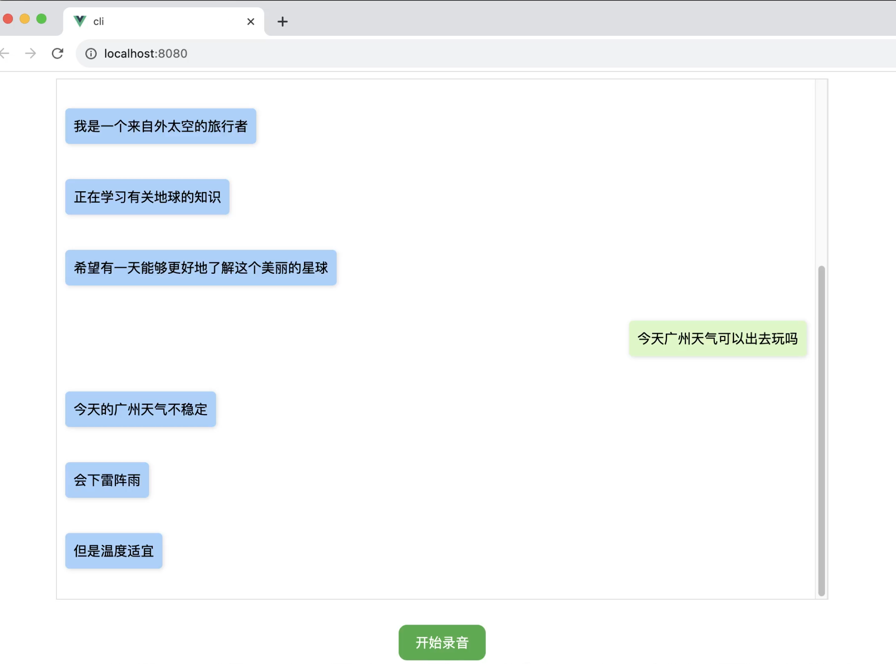

### 项目介绍

**当前这个项目的 euanaka项目的web前端。**
**当前必须连接的就是euanka项目的接口**

因为前面的euanka-client是树莓派，而且需要编译声卡驱动，配置声卡，再进行go和snowboy动态库的编译，很多环境限制。

### 运行效果



### 先决条件

### 构建

#### 本地构建运行
本地安装运行步骤如下：
```
npm install
npm run serve
```

如果想部署到服务器上，可以先使用下面命令编译项目:
```
npm run build
```

之后再部署到服务器上即可。


#### docker构建运行

先构建本地
```
npm run build
```
生成dist文件

再构建docker镜像


```
docker build --platform linux/amd64 -t registry.cn-shenzhen.aliyuncs.com/yuanfangqiao/euanka-web:0.2 -f Dockerfile .
```

运行
```
 docker run -d -p 80:80 -e VUE_APP_API_BASE_URL="ws://192.168.1.16:8080/ws/chat" registry.cn-shenzhen.aliyuncs.com/yuanfangqiao/euanka-web:0.1
```

### 已知问题

**浏览器F12打开控制台，前端web vue 录音报错 navigator.mediaDevices is undefined**

原因：Chrome浏览器，在http路径下由于安全性原因无法使用摄像头、麦克风

例：http://111.222.33:8081

默认是在localhost、file和https 域下使用，就是http://localhost 、file://xxxx、https://xxxxxx才能使用

解决方案：

Chrome 打开chrome://flags/#unsafely-treat-insecure-origin-as-secure 

将 Insecure origins treated as secure 这一项进行修改

将ip和前端的端口（一定要加端口喔，不然没卵用）输入，如"http://192.168.1.7"，并将后面的Disable改为Enable，再点击Relaunch，刷新页面


**现在打开浏览器实验一下吧，祝好运！**

### 参考项目
- [ChatGPT Voice Web](https://github.com/avdance/chatgpt_voice_robot)
- [微信接入ChatGPT](https://github.com/wangrongding/wechat-bot)


